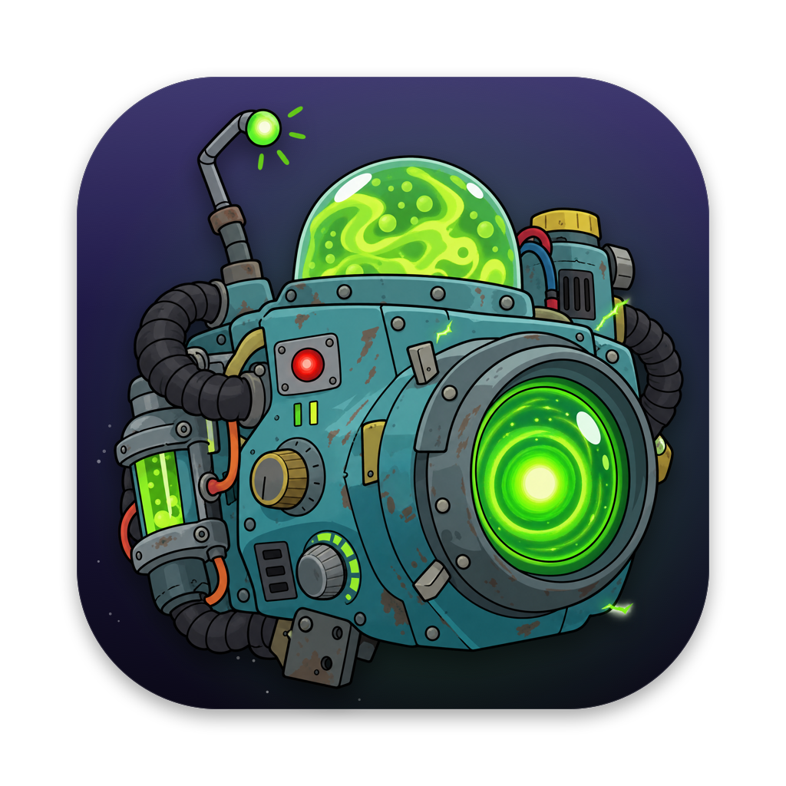

<p align="center">
  
</p>

<h1 align="center">YayaShot</h1>

<p align="center">
  <strong>Capture, record and edit your screen on macOS. Private by design.</strong>
</p>

<p align="center">
  <a href="https://github.com/YahyaElghobashy/yayashot/releases/latest">Download</a> ·
  <a href="#network-policy">Network policy</a> ·
  <a href="#build-from-source">Build from source</a> ·
  <a href="CHANGELOG.md">Changelog</a>
</p>

YayaShot is a sealed, rebranded build of
[BetterShot](https://github.com/KartikLabhshetwar/better-shot) by Kartik Labhshetwar,
an open-source Mac app for screenshots, screen recordings, and image and video editing.
It keeps BetterShot's capture tools and its Screen Studio-style video editor, removes
every path that uploads your files, and makes updates notify-only.

YayaShot is not affiliated with or endorsed by BetterShot or its author.

## What it does

**Screenshots.** Region, window, fullscreen and scrolling capture. OCR and a hex
color picker. Arrows, shapes, text, numbered markers, highlights, blur and pixelate.
Frame captures on a wallpaper, gradient or solid color with padding, rounded corners
and a shadow.

**Recordings.** Record a display, window or area with system audio, microphone,
camera and a teleprompter. Pause, restart or discard from a compact bar.

**Video editor.** Automatic zoom on clicks with spring motion (switch Auto Zoom off
or delete any zoom), cursor smoothing, click effects and idle hiding, camera layouts,
captions from on-device speech recognition, cuts, speed changes, masks, 3D shots with
depth blur, and MP4 or MOV export at 30 or 60 fps in 16:9, 9:16, 1:1 or 4:5.

**Share.** Share opens the macOS share sheet (AirDrop, Messages, Mail, Notes and
any installed share extensions). Nothing goes to a YayaShot server, because there
isn't one.

## Network policy

YayaShot makes exactly one kind of network request, and only when you ask for it:

| When | Where | What is sent | Off switch |
| --- | --- | --- | --- |
| You click **Check for Updates** in Settings > About, or turn on the launch check (off by default) | `api.github.com` | An HTTPS GET for the latest public release of this repository and of upstream BetterShot. No identifiers, no cookies. | Leave the toggle off and don't click the button |

All requests go through one wrapper, [`Sources/Sealed/NetworkPolicy.swift`](Sources/Sealed/NetworkPolicy.swift),
which allows HTTPS GET to `api.github.com` and refuses everything else before a socket
opens. [`Tools/check-sealed.sh`](Tools/check-sealed.sh) fails the build if network code
appears anywhere else, a process other than `screencapture` is launched, or the allowlist changes. `build.sh` runs it before compiling and again on the finished app. On-device speech recognition may
download Apple's language model through macOS the first time you use captions.

**Removed from upstream**

- Cloud sharing to a Cloudflare R2 bucket: the uploader, credential store, share
  manifest, share-link generation and the Sharing settings tab. Share now opens the
  macOS share sheet.
- The self-installing updater that downloaded a DMG from GitHub, mounted it and
  replaced the app. The update check now shows the release notes and opens the
  release page in your browser. It never downloads anything.
- The `yayashot://capture/fullscreen` link, which let any local process take a silent
  full-screen screenshot through YayaShot's Screen Recording permission. The remaining
  links all need an on-screen selection or click.
- The project website, the web share viewer, the upstream author's social links and
  the AI assistant configuration files.

## Build from source

Requirements: an Apple silicon Mac on macOS 26 or later with the Command Line Tools
(`xcode-select --install`). Xcode is not needed.

```bash
git clone https://github.com/YahyaElghobashy/yayashot.git
cd yayashot
Tools/setup-signing.sh      # once: a stable local signing identity so permissions survive rebuilds
./build.sh --install        # builds dist/YayaShot.app and copies it to /Applications
Tools/check-sealed.sh dist/YayaShot.app
```

`./build.sh --dev` builds `YayaShot (Developer).app` with its own bundle id, so it can
run next to the installed app. The build compiles against the macOS 26 SDK because the
macOS 27 SDK turns SwiftUI property wrappers into macros whose compiler plugin ships
only with Xcode.

Builds are signed with a self-signed identity, not notarized. A copy downloaded from
the Releases page needs **System Settings > Privacy & Security > Open Anyway** the
first time.

## Permissions

| Permission | Used for |
| --- | --- |
| Screen & System Audio Recording | Screenshots, recordings, system audio |
| Microphone | Narration and voice screenshots |
| Camera | The camera bubble, only when you turn it on |
| Input Monitoring | Precise pointer motion for smooth cursor and click zooms, and the shortcut overlay. Plain typing is never recorded. |
| Accessibility | Global shortcuts and Auto Scroll in scrolling capture |

Recordings, screenshots, transcripts and settings stay in your chosen folders and in
`~/Library` on this Mac.

## Icon

The icon is an alien tech camera in a Rick and Morty-inspired cartoon style, generated in
one image-model pass and placed on a dark space tile by
[`Tools/MakeIcons.swift`](Tools/MakeIcons.swift), which also draws the menu bar glyph as
vector art. Sources and two alternate concepts are in [`Resources/Brand`](Resources/Brand);
the first 1.0.0 icon is kept in `Resources/Brand/v1-alien-eye`. The onboarding images and
demo videos in `Resources/Onboarding` are upstream's and still show BetterShot's interface.
The bundled wallpapers are new: upstream's "macOS" set had no recorded license, so it
was replaced with original gradients under the same file names.

## Yaya Suite

YayaShot is part of [Yaya Suite](https://github.com/YahyaElghobashy), the one-installer
bundle for Yaya's Space, Deck, Dailies and YayaShot. The installer talks to the app through
three launch flags: `--permissions-json` (prints permission state and exits),
`--login-item on|off` and `--onboarding` (replays the tour and writes
`~/Library/Application Support/YayaSuite/handoff/yayashot.done` when it finishes).

## License

The YayaShot app as a whole is distributed under the
[GNU Affero General Public License v3](Resources/Licenses/Cap.txt), because it combines
code adapted from [Cap](https://github.com/CapSoftware/Cap) (AGPL-3.0-only, rendering and
editor timeline code) with code adapted from Boring Notch and
[MacShot](https://github.com/sw33tLie/macshot) (GPLv3). The files that come from
BetterShot remain available under its [BSD 3-Clause License](LICENSE), copyright
Kartik Labhshetwar, and the vendored packages (DockProgress, DynamicNotchKit, TourKit)
under MIT. Every notice is in [`Resources/Licenses`](Resources/Licenses), is bundled
inside the app, and opens from **Settings > About > Licenses**.

This repository is the corresponding source for every YayaShot release: each release
is built from the tag of the same version. YayaShot's own changes are offered under
the BSD 3-Clause License, like the base. The bundled wallpapers are original and
released under CC0 ([details](Resources/Licenses/Wallpapers.txt)).

YayaShot comes with ABSOLUTELY NO WARRANTY.

"BetterShot" is the name of the upstream project; see [TRADEMARKS.md](TRADEMARKS.md).
